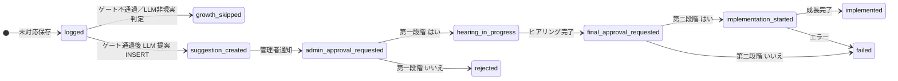

# NEAR 成長フロー（設計メモ）

## 成果物インデックス

1. **DB**: `src/db/migrations/003_growth_flow.sql`（`unsupported_requests` 拡張、`implementation_suggestions` 拡張、`growth_admin_sessions`、`growth_hearing_items`、`capability_registry`）
2. **サービス**: `growth_orchestrator.ts`, `growth_suggestion_gate.ts`（suggestion 前ゲート）, `approval_service.ts`, `hearing_service.ts`, `cursor_prompt_builder.ts`, `coding_runner.ts`, `deploy_runner.ts`, `admin_notification_service.ts`, `capability_sync_service.ts`, `growth_admin_line.ts`, `growth_constants.ts`, `lib/growth_tiers.ts`（難易度ラベル）
3. **エントリ**: `orchestrator.ts`（管理者 LINE 優先）、`feature_suggester.ts`（提案後 `onSuggestionCreated`）、`admin/routes.ts`
4. **capabilities**: `capability_registry` を参照する `listCapabilityLines(db)`（空なら静的フォールバック）

## 状態遷移（概要）

`implementation_suggestions.implementation_state` は `not_started` → `hearing_required` → `awaiting_final_approval` → `coding` →（任意）`testing` → `deploy_candidate_ready` → `deploying` → `implemented` / `failed`。遷移は `approval_service` 経由。

## Cursor 向け指示

- `cursor_prompt_builder.buildFinalCursorPrompt` が第二承認後にフル文を生成し DB に保存。
- 手動モード（既定）: `coding_runner` は説明メッセージのみ。自動モードは `GROWTH_AUTO_CODING_ENABLED` と `GITHUB_TOKEN`+`GROWTH_GITHUB_REPO`（Issue 作成）または `GROWTH_CODING_AGENT_URL`（POST）。未設定はスタブ。

## Suggestion ゲート（既定）

`evaluateGrowthSuggestionEligibility` が `scheduleFeatureSuggestion` より前に動く。`out_of_scope`、短文、`needs_followup`、低 confidence の `unknown`、同一 fingerprint 件数不足（`GROWTH_MIN_FINGERPRINT_COUNT`、既定は 1）などで `growth_skipped` になる。環境変数は `DEPLOY.md` 参照。

## 成長難易度（E〜SSS）

- `implementation_suggestions.difficulty` に **E, D, C, B, A, S, SS, SSS** を保存（**E が最も易しく、SSS が最難**）。旧データに `low` / `medium` / `high` が残っていても動作上は問題ないが、通知の【成長難易度】行は新 tier のみ表示する。
- LLM の structured output は `src/models/intent.ts` の `featureSuggestionSchema`。プロンプトは `prompts/feature_suggestion.system.md`。
- **`trivially_infeasible: true`**（非現実的・明らかに範囲外）のときは `implementation_suggestions` を **作らず**、`markUnsupportedGrowthSkipped` で `growth_skipped`（notes に `trivially_infeasible` と理由）。

## 安全

- 第二承認なしで `coding` に入れない（`setFinalApprovalAndStartCoding`）。
- `deploying` へ API 遷移時は `deploy_safety_confirmed: true` が必須。
- 秘密はログに出さない（方針）。ヒアリング回答は `required_information` JSONB に保存。

## 実装順（推奨）

1. マイグレーション適用と `ensureSchema`
2. `approval_service` + `growth_orchestrator` + LINE 管理者ハンドラ
3. ヒアリング + `cursor_prompt_builder`
4. 管理 API 拡張
5. runner アダプタの本番接続（Phase 3）
