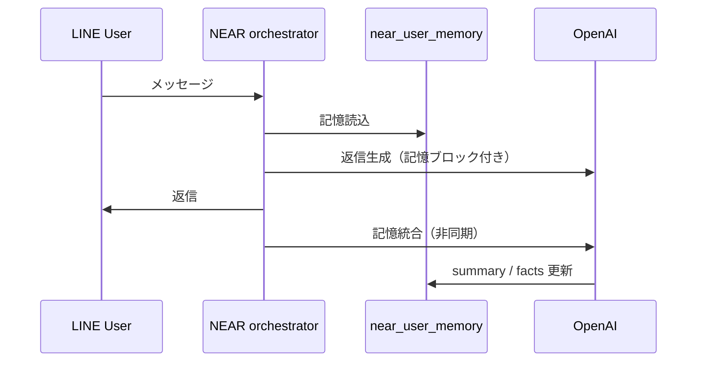

# NEAR ユーザー長期記憶

LINE ユーザーごとに **好み・役割・よく使う手順** を Postgres に蓄積し、毎ターンの LLM プロンプトへ注入します。OpenAI の fine-tune ではありません。

## テーブル

| オブジェクト | 説明 |
|--------------|------|
| `near.near_user_memory` | 要約 `memory_summary`、構造化 `memory_facts`、呼び方 `call_preference` |
| `near.near_line_user_profiles.memo` | 管理者手動メモ（**優先**してプロンプトに載る） |

## 環境変数

| 変数 | 既定 | 意味 |
|------|------|------|
| `NEAR_USER_MEMORY_ENABLED` | ON | 読取・更新のマスタースイッチ |
| `NEAR_USER_MEMORY_CONSOLIDATE_ENABLED` | ON | 会話後の LLM 更新 |
| `NEAR_USER_MEMORY_CONSOLIDATE_EVERY_N_TURNS` | 1 | 何ターンごとに更新するか |
| `NEAR_USER_MEMORY_MIN_USER_CHARS` | 4 | これ未満の短文は更新スキップしやすい |
| `NEAR_USER_MEMORY_MAX_FACTS` | 24 | ファクト上限 |
| `NEAR_USER_MEMORY_MODEL` | （空→intent モデル） | 更新用モデル |

無効化: `NEAR_USER_MEMORY_ENABLED=false`

## フロー

## 製品成長との違い

| | ユーザー記憶 | Improvement Capsule / Growth |
|--|--------------|------------------------------|
| 目的 | **その人**に合わせる | **NEAR の機能**を増やす |
| 保存先 | `near_user_memory` | `near_improvement_capsules` 等 |

## migration

`064_near_user_memory.sql`（`npm run migrate` / 起動時 `ensureSchema`）

## 管理 API

`GET /admin/user-memory?line_user_id=Uxxxx`（Bearer `ADMIN_API_KEY`）

## PII

更新前後でメール・長い数字列をマスクします。機密を `memo` に書く場合はアクセス制御に注意してください。
